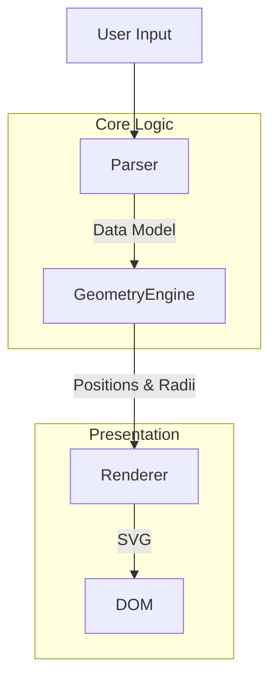

# Architecture of Venn Diagram Generator

## High-Level Architecture

The system is designed with a separation between the core logic (parsing, geometry calculation) and the presentation layer (rendering, UI interaction).

## Component Descriptions

1.  **Parser (`parseVennCode`):**
    *   **Responsibility:** Reads the raw text input and converts it into a structured JSON object containing sets, labels, values, and intersection data.
    *   **Tech:** Pure JavaScript (Regex/String manipulation).

2.  **Geometry Engine (`generateCirclePositions`, `adjustForSeparation`):**
    *   **Responsibility:** Calculates the center coordinates (`cx`, `cy`) and radii (`r`) for each set circle based on the number of sets and intersection requirements. Handles force-directed layout adjustments for complex overlaps.
    *   **Tech:** Pure JavaScript (Math/Trigonometry).

3.  **Renderer (`generateDynamicDiagram`):**
    *   **Responsibility:** Takes the geometric data and generates an SVG string with circles, labels, and text.
    *   **Tech:** JavaScript Template Strings, SVG.

4.  **UI Controller (`generateDiagram`, `toggleTheme`):**
    *   **Responsibility:** Manages DOM events, themes, and updates the view.
    *   **Tech:** DOM API.
